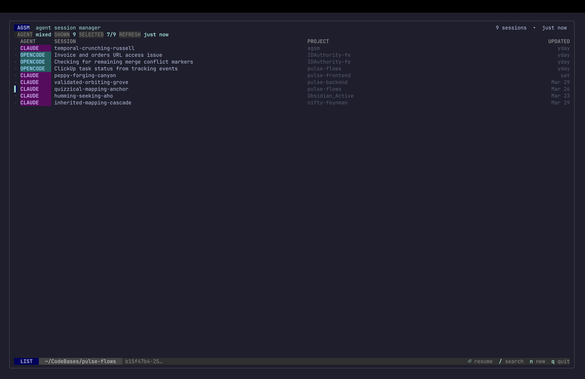

# AGSM

AGSM is a terminal UI for discovering, browsing, and resuming coding-agent sessions from one place.



Current public scope:
- OpenCode and Claude Code support
- unified session list across supported agent storage backends
- resume, refresh, rename, delete, and new-session launch flow
- adaptive terminal theming with a full-screen TUI

## Status

AGSM is early `v0.x` software.

The current release supports OpenCode and Claude Code. Codex support is still planned, but not included yet.

## Features

- Full-screen TUI for OpenCode and Claude Code sessions
- Session discovery from both:
  - OpenCode JSON session storage
  - OpenCode SQLite-backed session storage
  - Claude Code JSONL session storage
- Search and quick navigation
- Resume selected session in its source agent CLI
- Rename sessions with AGSM-managed metadata
- Delete sessions from the UI
- Start a new session from a chosen directory with an explicit agent picker

## Requirements

- `opencode` installed and available on `PATH` for OpenCode support
- `claude` installed and available on `PATH` for Claude Code support
- macOS or Linux

## Install

With Homebrew:

```bash
brew tap 3ux1n3/tap
brew install agsm
```

This repo publishes tagged tarballs plus `checksums.txt` for the Homebrew tap to consume.

From source with Go:

```bash
go install github.com/3ux1n3/agsm@latest
```

## Run

If installed with `go install`:

```bash
agsm
```

Show the build version:

```bash
agsm --version
```

From this repository:

```bash
make run
```

## Releases

Tagged releases are published by `.github/workflows/release.yml`.

Create a release:

```bash
git tag v0.1.0
git push origin v0.1.0
```

Each release uploads:

- macOS and Linux tarballs for `amd64` and `arm64`
- `checksums.txt` for downstream packaging, including Homebrew tap formula updates

## Configuration

Runtime config follows `os.UserConfigDir()` for your platform.

- macOS:
  - config file: `~/Library/Application Support/agsm/config.toml`
  - metadata file: `~/Library/Application Support/agsm/metadata.json`
- Linux:
  - config file: `~/.config/agsm/config.toml`
  - metadata file: `~/.config/agsm/metadata.json`

You can override the config directory entirely with `AGSM_CONFIG_HOME`.

This repository also includes a local `.config/` directory for project-owned examples and future development config.

Example config:

```toml
sort_by = "last_active"
sort_order = "desc"

[agents.opencode]
enabled = true
# session_path = "/Users/you/.local/share/opencode/storage/session"

[agents.claude]
enabled = true
# session_path = "/Users/you/.claude/projects"

[ui]
nerd_fonts = false
color_scheme = "auto"
```

See `.config/agsm.example.toml` for the committed example file.

## Notes

- OpenCode session discovery reads both legacy JSON storage and current DB-backed sessions.
- Claude Code session discovery reads local JSONL session files from `~/.claude/projects` by default.
- AGSM stores custom session names in its own metadata file instead of modifying OpenCode session data.
- New session creation includes an explicit agent selector in the modal.
- Claude session deletion currently removes the discovered local session file only.

## Keybindings

- `↑` / `↓`: move selection
- `Enter`: resume selected session
- `/`: search
- `Esc`: clear search or cancel modal
- `Ctrl+N`: new session
- `Ctrl+R`: rename session
- `Ctrl+D`: delete session
- `Ctrl+L`: refresh
- `q`: quit

New session modal:

- `Tab`: move between fields
- `←` / `→`: switch agent
- `Enter`: launch the session

## Development

Useful commands:

```bash
make fmt
make test
make build
make run
```

## Roadmap

- [ ] Add GitHub Actions CI
- [ ] Add `CONTRIBUTING.md`
- [ ] Add issue templates
- [ ] Add pull request template
- [ ] Add Codex adapter
- [x] Add screenshots and demo GIF to README

## License

MIT. See [`LICENSE`](./LICENSE).
